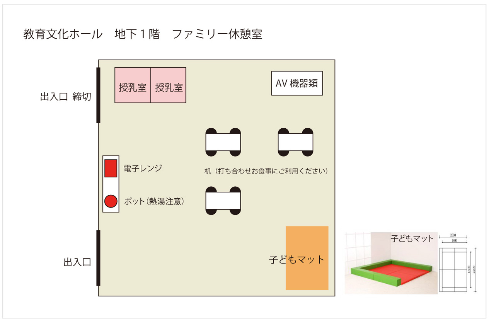
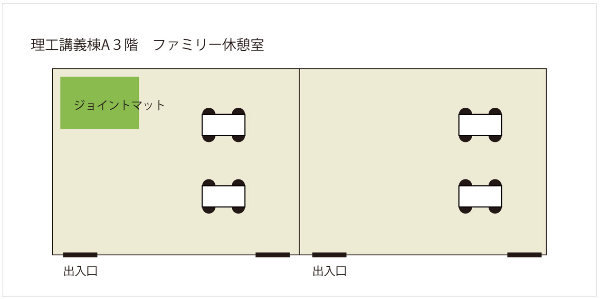

<!--キャリア支援委員会担当者様

こんにちは。ESJ72運営部会長の橋本洸哉です。

今回は、みなさまにホームページの原稿のご作成をご依頼したくメールしました。先日、ESJ72の公式ホームページが稼働を開始しました。現在は、主に日程・会場の周知と、公募セッション・ERシンポジウムの募集が主な情報になっております。9月後半にはホームページを大幅に更新し、大会案内（会場情報等）と各種講演（集会・一般講演・高ポス）の申込み情報を掲載する予定です。運営部会では、現在、9月の更新に向けて準備を進めています。

キャリア支援委員会の皆様には、ESJ72のWebサイト上で掲載する「育児支援」のページの執筆をお願いします。去年の原稿を基にした構成原案をお送りします。原稿を執筆の上、締め切りまでにWeb掲載依頼チャンネルにてお送りください。公開は9月下旬を予定しています。

・markdown形式の細かい書き方は、説明ページ（https://github.com/hmito/esj72web/blob/main/docs/esj_web_markdown.md）をご覧ください。
・原稿の情報は昨年度のままです。
・Webサイト更新は、9月下旬の次は応募締切後の12月を予定しています。12月ごろまで確定しない情報は一度消していただいてかまいません。
・必要に応じて英語版の作成もお願いいたします。
・育児支援に関する情報の詳細は12月の更新タイミングでもかまいませんが、支援を必要とする参加者の方々の申込の有無を左右しうるため、可能な範囲で「参加の可否判断」の助けとなる育児支援の有無等についての内容を執筆いただけると幸いです。
・構成原案はあくまで参考ですので、適宜情報が伝わりやすいよう、編集をお願いします。
・会場の環境等については、実行委員会と適宜やり取りを進めていただければと思います。
・なお、育児支援以外にも、若手を中心としたキャリア支援の取り組みについても例年通り実施されるのであれば専用ページを設けて執筆をお願いする予定です。こちらの掲載は12月を予定しています。
・ページ構成については自由が利きますので、ページを分けた紹介が必要な企画等あれば、運営部会までご相談ください。

お手数おかけしますが、何卒よろしくお願いいたします。

運営部会長　橋本洸哉
-->

<!-- 託児費補助の項目が細切れすぎて逆に見づらく、情報も重複していたので、整理して修正しました　by 池川 -->

# 育児支援

ESJ71では、昨年同様に[託児費の一部補助](#託児費補助)を実施します。また、会場にも[ファミリー休憩室](#ファミリー休憩室)など、お子様と一緒に利用可能な部屋を設置する予定です。

## 託児費補助

本大会では託児へのサポートを、昨年度同様、**対象者が利用した託児料金の半額を負担する**という形で行います。

### 内容
- 対象者は大会に参加する日本生態学会員、もしくはシンポジウムやフォーラムに発表者やコメンテーターとして招待されている非学会員。
- 対象者がお住まいの地域、もしくは大会会場（横浜市及びその近隣地域）の地域にて、2024年3月16日（土）から3月21日（木）までの期間中にシッターの利用、保育園の一時保育等を利用した場合に適用。
- 利用料金の半額補助。ただし子供1人あたりの上限は5000円/日で、子供の数に制限はありません。ただし、申込数が想定を超えた場合は補助額が減額となる可能性があります。

### 申し込みの手順

#### １. 事前申込み

-  申し込み期間は、2024年1月17日（水）から2024年2月20日（火）といたします。[こちらの申込みフォーム](https://forms.gle/mscwZxBbaBgwg6LUA)からお申し込み下さい。**事前申し込みがないと、託児補助は受けられませんので、ご注意願います。**
-  申し込みをいただいた方には、実行委員会から折り返しメールにてご連絡させていただきます。万一、2月中に返信がない場合には、恐れ入りますが実行委員会託児担当（<nursery@esj.ne.jp>）にご連絡いただきますようお願い申し上げます。

#### ２. 事後の書類提出

-  ESJ71終了後、2024年3月28日（木）の23:59までに託児利用の内訳（名前、日付、人数、時間等）がわかる領収書をご準備いただき、領収書画像を国内の振込先口座情報とともに下記のメールアドレスまでお送りください。

### 問い合わせ先

書類の提出および託児費補助に関係する各種問い合わせは以下のメールアドレスまでお願いします。  
<nursery@esj.ne.jp>（実行委員会 託児担当）

## 育児施設

横浜国立大学では以下の施設・設備をお子様と一緒に利用可能です。

### ファミリー休憩室

**利用可能時間** 
 3月19日（火）8：45～18：15   
 3月20日（水）8：45～18：15   
 3月21日（木）8：45～12：15

- 教育文化ホール［S1-2］の地下1階と理工学部講義棟A［S5-5］の３階に子供と一緒に利用できるファミリー休憩室を用意します（[地図はこちら](https://esj-meeting.net/wp-content/uploads/2024/03/campus_map_ja.pdf)）。
- 託児業者は配置しませんので、必ず保育者（保護者やシッター等）が付き添うようにしてください。
- 利用等に際して，事故等が発生した場合の責任につきましては，利用者の責任となります。事前申し込みは不要です。
- オムツ交換は基本的にサポートルームかトイレでお願いします（ファミリー休憩室で食事もするため。下の「サポートルーム」「多目的トイレ（オムツ替え可）」をご参照下さい）。

### 教育文化ホール［S1-2］の地下1階

- フロアマット＋サイドガード（２畳程度）、授乳用のスペース、電子レンジ、ポットを用意します。
- 乳児を優先しますので、ご協力ください。
- 地下１階まではエレベーターがないため、徒歩で降りることになります。ベビーカーの運搬等はスタッフが補助しますので、遠慮なくお声がけください。

### 理工学部講義棟A［S5-5］の３階

幼児以上を優先。ジョイントマット（３畳程度）、３階まではエレベーターが利用できます。  

[**横浜国立大学サポートルーム**](https://diversity.ynu.ac.jp/care/childcare/supportroom/)

### 利用可能時間：  
3月19日（火）8：45～17：15  
3月20日（水）祝日のため利用できません  
3月21日（木）8：45～17：15  
場所：経営学部１号館［N3-4, [地図](https://esj-meeting.net/wp-content/uploads/2024/03/campus_map_ja.pdf)］１階101室

- 安全管理上、施錠しております。利用されたい方は、大会の総合受付（教育文化ホール）まで鍵を取りに来ていただけますようお願いいたします。
- こちらも子供と一緒に利用できる休憩室です。
- ソファーが用意されていますので、体調不良や妊娠中で気分がすぐれず横になりたい時、授乳、搾乳、オムツ替え（ただしゴミは持ち帰り）等にも利用ができます。
- サポートルームは横浜国立大学の関係者が利用する場合もあります。互いに譲り合ってご利用ください。ファミリー休憩室と同じく、託児業者は配置しませんので、必ず保育者（保護者やシッター等）が付き添うようにしてください。
- 利用等に際して，事故等が発生した場合の責任につきましては，利用者の責任となります。事前申し込みは不要です。

### 多目的トイレ（オムツ替え可）

下記の場所に、オムツ替えのできる多目的トイレを設置しています（オムツ用ゴミ箱はないので、お持ち帰りをお願いします）。

### 教育文化ホール［S1-2, [地図](https://esj-meeting.net/wp-content/uploads/2024/03/campus_map_ja.pdf)］１階

### 利用可能時間：  
3月19日（火）8：45～18：15  
3月20日（水）8：45～18：15  
3月21日（木）8：45～12：15

### 中央図書館［S3-6, [地図](https://esj-meeting.net/wp-content/uploads/2024/03/campus_map_ja.pdf)］2階「みんなのトイレ」

### 利用可能時間：  
3月19日（火）8:40～17:00  
3月20日（水）祝日のため休館  
3月21日（木）8:40～17:00

- 入館ゲートの外にあるので、学外の方にも手続き不要でご利用いただけます。
- ベビーカーや車椅子等をご利用の場合は、中央図書館1階のエントランスから2階のトイレへ移動する経路にエレベーターがないため、メインストリートから、[教育学部講義棟6号館](https://shisetsu.ynu.ac.jp/gakugai/shisetsu/2campus/barrierfree/barrier_file/3minami.pdf)［S3-1］の隣にある外エレベーターで2階へ移動して、中央図書館2階のエントランスから入館してください。

