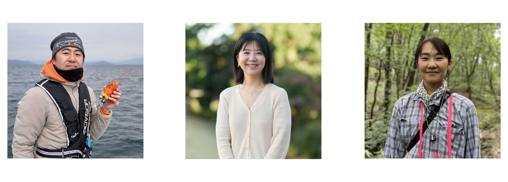

<!--高校生ポスター部会担当者様

運営部会よりお願い

ESJ72のWebサイト上で掲載する「高校生向け企画」についてのWebページの執筆をお願いします。去年の原稿を基にした構成原案をお送りします。原稿を執筆の上、締め切りまでにWeb掲載依頼チャンネルにてお送りください。公開は9月下旬を予定しています。

・Webサイト更新は、9月下旬の次は応募締切後の12月を予定しています。
・発表方法や制限等応募に際して必要な情報は、今回の原稿でできる限り全てご記載ください。なお、細かい注意書きやONLINE CONF/会場に関する説明に関しては、12月の更新に合わせてページをアップデートいただいてもかまいません。
・原稿の情報は昨年度のままです。
・構成原案はあくまで参考ですので、適宜情報が伝わりやすいよう、編集をお願いします。特に高校生は学会に不慣れなため、申込に際して必要な情報がすぐ見つかるよう、情報の取捨選択・整理をお願いします。
・「発表方法」と「ハイブリット開催に伴う現地会場でのポスター掲載について」については、内容を整理統合して一つのセクションにまとめられるかもしれません。

お手数おかけしますが、よろしくお願いいたします。

運営部会長　橋本洸哉
-->

# 高校生向け企画

「[高校生ポスター発表会](high_school_student/#高校生ポスター)」と「[みんなのジュニア生態学講座](high_school_student/#みんなのジュニア生態学講座)」は、生態学の社会への普及・教育のため、日本生態学会によるアウトリーチ活動の一環として企画されています。高校生（中学生も歓迎です）にポスター発表をしていただき、生態学諸分野の専門家や学生、他の参加校との交流を通して、生態学全般への関心をさらに高めてもらうことが本企画のねらいです。生き物の生態や環境に関わる生物学の内容であれば、どのような分野や題材の発表でも大歓迎です。既に他の学会等で発表された研究の場合、そこからどのように発展したのかを含め、研究の集大成・経過報告としてご発表ください。参加費は無料です。

「みんなのジュニア生態学講座―高校生と研究者の交流会」は今年で10年目を迎えます。現在活躍中の生態学者に、高校生や大学生の頃の話や現在の研究に至った経緯などを話していただき、高校生に研究者を身近に感じてもらう交流会を行ないます。Zoomを用いてリアルタイムで実施します。

**日時**

- 2024年3月17日（日）13:00～15:00 高校生ポスターコアタイム（オンライン）［奇数ポスター(13:00～14:00); 偶数ポスター(14:00～15:00)］
- 2024年3月17日（日）15:30～17:00 みんなのジュニア生態学講座＆表彰式
- 2024年3月20日（水・祝）11:00～13:00 高校生ポスターコアタイム（現地会場）

## 高校生ポスター

### 発表資格・参加費

原則として、高等学校（中学校）または高等学校に相当する教育機関に在籍する生徒であること。国籍は問いません。

本大会においては、学校ごとに発表件数の制限はありません。ただし、後述のポスター賞の審査対象となるのは、１校あたり最大２件です。審査対象の候補となるポスターは各校が申し込み前に選定してください。申し込み後は、審査対象を変更できませんのでご注意ください。

発表者（人数に制限なし）および顧問の教員等（１校につき２名まで）は、大会参加費が免除されます。聴講のみの参加の生徒も無料です。

### 発表方法

ポスター発表は、オンライン会場となる大会プラットフォーム（ONLINE CONF）にアップロードされたポスターファイルを、参加者が大会期間中に自由に閲覧できる形式で実施します。

ポスターの様式やファイルのアップロード方法については、[オンラインポスター発表の方法](info_oral_poster_ja#オンラインポスター発表の方法)を参照してください。それ以外の高校生ポスター独自の注意点等については、以下の通りです。

- 高校生ポスターのグラフィカルアブストラクトのアップロードは必須です。グラフィカルアブストラクトは、プラットフォーム上でのポスターのサムネイルとして用いられます。研究内容を要約したイラストや図表、研究対象生物の写真などを使うのも良いでしょう。自由な発想で自身の研究をアピールし、聴衆に聞いてみたいと思わせるような工夫をしてみてください。説明動画のアップロードは、必須ではありません。
- 高校生ポスターでは、今年度から試験的に、「著者の貢献（オーサーコントリビューション）」をポスター内に明記することを必須とします（ポスターの下部や最後のページ等、目立たない所でもかまいません）。それぞれの講演者が発表にどのように貢献をしたのかを明らかにするため、例えば以下のような項目について、貢献の有無を表記してください：研究の構想やデザイン、データ収集、実験の実施、データの分析と解釈、発表の用意、研究の補助・指導、実験技術の提供・指導。これらの項目はあくまで一例なので、研究内容の実態に合わせて、適宜項目を変更してください。講演者に含まれる全員が、なんらかの項目で発表に貢献していることが必須です。
- 著者の貢献の表記例。例えば、３人の生徒（生徒一郎、生徒二郎、生徒三郎）が、顧問の高校教員（顧問つばさ）と一緒に考えた研究テーマで、大学教員（大学あゆむ）の指導の下で実験を行い、特に生徒一郎のアイデアが実験の重要なポイントになっている場合：『研究の構想やデザイン：生徒一郎、生徒二郎、生徒三郎、顧問つばさ；データ収集、データの分析と解釈、発表の用意：生徒一郎、生徒二郎、生徒三郎；実験のアイデア：生徒一郎；実験技術の提供・指導：大学あゆむ』。
- 高校生の方には馴染みがないかと思いますが、科学論文を発表する際には、それぞれの著者の貢献を明記することはよく行われます。皆さんも、学会発表の前に自分たちのこれまでの研究活動を振り返る良い機会として利用してくれることを期待しています。

### ポスター賞

選考委員会が内容を評価し、内容が優れていたポスターは最優秀賞や優秀賞などとして表彰します。

- 審査はポスター本体を対象に行います。ポスター1件につき複数名の審査員が配置されます。
- 審査は以下の5つの審査項目で行われます。１）研究の新規性・独自性、２）手法と解釈の適切さ、３）データの質・量、４）論理の妥当性、５）情報を伝える工夫・配慮
- 上記の項目とは別に、高校生ならではの豊かな発想や研究活動へのひたむきな努力が見られるポスター等を対象に、審査員特別賞を選定します。
- ポスター賞の発表や表彰式は、「[みんなのジュニア生態学講座](high_school_student/#みんなのジュニア生態学講座)」の中で行われます。

### ハイブリット開催に伴う現地会場でのポスター掲載について

- 本大会はオンライン（3月16・17日）およびハイブリッド（横浜国立大学 + オンライン、3月18〜21日）形式で開催されます。高校生ポスターのコアタイムやポスター賞審査は、3月17日（日）に大会プラットフォーム上で行われます。オンラインでのポスター発表を行なった方は、希望する場合、3月19日（火）・20日（水・祝）に現地会場でもポスターを掲示することができます。
- 現地会場での発表を希望されていたポスターの全てが掲載可能になりました。ポスターが掲載可能な期間は3月19日（火）・20日（水・祝）の二日間、現地会場のコアタイムは20日11:00～13:00 で、発表時間の内訳は以下の通りです。コアタイム中は該当ポスターの発表者はポスターの前に立っていただき、議論や交流を行ってください。
- 現地会場コアタイム\[PH-01～PH-32\]　11:00～11:30＝奇数ポスター、11:30～12:00＝偶数ポスター、12:00～12:30＝奇数ポスター、12:30～13:00＝偶数ポスター
- ポスターの掲示は、A0縦ボードに行います。このサイズの範囲内であれば、例えばA0１枚での掲示や、オンライン版の分割されたものをそのまま掲示するなど、発表者は自由に使用していただいて構いません。ただし、サイズをオーバーして隣のボードに入り込むなど、他の発表者の邪魔にならない範囲での掲示をお願いします。
- ポスターを貼るための画鋲は持参してください。例年、会場周辺の店舗では品薄になりますので、ご注意ください。
- 本大会は、日本生態学会では久々のオンサイトでのポスター発表となります。当日は混雑も予想されますので、感染症対策等、ご自身の責任で適切に行っていただきますようお願いいたします。

### 申込み手順

- 発表申込は大会申込サイトからオンラインで受け付けます。発表を希望する高校は、大会公式ホームページで随時最新情報をご確認ください。10月上旬頃に受付を開始し、2023年10月31日（火）が締切となります。なお発表希望申込数が非常に多い場合には、申込先着順で打ち切る可能性もありますので、早めの申込みをよろしくお願いいたします。
- 発表申込者は原則、顧問や担任の教員または保護者とします。要旨登録などの諸手続きに責任を負っていただける方にしてください。
- 発表申込時に、講演者の登録を行っていただきます。講演者には、以下のいずれかの点で研究に重要な貢献を行った、生徒、顧問や担任等の高校教員、指導や研究協力を行った外部の大学教員等、が含まれます（テーマやアイデアの発案、研究デザインの作成、観察や実験の実施やデータの収集、データの解析、データの解釈や議論、発表の用意、等）。また、講演者の全員が生態学会での発表に同意している必要があります。本大会より、発表ポスター内でそれぞれの講演者の研究に対する貢献（オーサーコントリビューション）を明記してもらうことを計画しています。詳細については後日アナウンスします。
- 講演者の資格の考え方の例：(1)ある班が、顧問の先生の発案した研究テーマについて、研究協力者の大学教員の指導の下で実験装置を借りて実験し、研究をまとめた＝班員の生徒、顧問、研究協力者の大学教員の全員が講演者の資格を持つ；(2)ある班が、班のメンバーで研究テーマの案を考え、顧問のアドバイスを踏まえながらテーマを決定し、顧問の指導の下で研究デザインの構築や実験を進め、結果をまとめた＝班員の生徒、顧問の教員が講演者の資格を持つ；(3)ある班が、班のメンバーで相談して決めた研究テーマについて自分たちで主体的に実験に取り組み、顧問や研究協力者からは中間報告等でアドバイスをもらいながら研究をまとめた＝班員の生徒のみが講演者の資格を持つ
- 発表内容の要旨（日本語で800字以内）は、2024年1月31日(水)までに同じく申込みシステムから登録していただきます。システムへのアクセス方法等は、大会ウェブページでお知らせします。
- 発表を行なわない生徒が聴講を希望する場合は、大会の聴講者として通常の参加申込（中・高校生は無料）の方法によりお願いします。
- みんなのジュニア生態学講座のみの聴講を希望される方は、2024年3月17日（金）までに、大会公式ホームページに用意する専用フォーム(大会申込サイトとは別)から申込を行なってください。なお、高校生ポスター発表（引率者含む）ならびに通常の参加申込をされている方は、大会プラットフォームから直接アクセス可能ですので、改めて聴講の希望を申し込む必要はありません。
- 問い合わせは、大会公式ホームページの「お問い合わせフォーム」をご利用ください。

### 注意事項

申込内容や要旨の修正の要望が例年多数寄せられます。タイトルや発表者などの情報は、十分検討してから登録してください。今大会は、正誤表による修正は受け付けませんのでご了承ください。

## みんなのジュニア生態学講座

生態学に関連するアカデミア内外で大活躍中の３名に、ご自身の研究内容や仕事内容だけでなく、生態学に関わりを持ったきっかけや中学～高校の様子を語っていただきます。Zoomミーティングを用いてリアルタイムで実施します。

- 吉⽥ 誠 (東京⼤学) 「バイオロギングで知る⿂の⽣態」
- 寺⽥ 佐恵⼦ (⽟川⼤学) 「豊かな⾃然と⼈々の笑顔を未来に」
- 宮崎 祐⼦ (岡⼭⼤学) 「⼭の実りの豊凶とその影響が知りたい」

[ジュニア生態学講座ポスターはこちら](https://esj-meeting.net/wp-content/uploads/2024/01/lecture_for_junior_ecologist.pdf)

**高校生ポスターの参加者を含め、大会参加申込済みの方は、申込不要です。**
大会参加申込を行わず、ジュニア生態学講座のみの視聴を希望する場合は、以下のフォームからお申込みください。お申込みいただいたアドレスに、当日までに視聴用URLをお送りします。  
[申込フォーム ※高校生ポスター参加者は申込不要](https://forms.gle/JHKigkLetzZiUBYq7)

