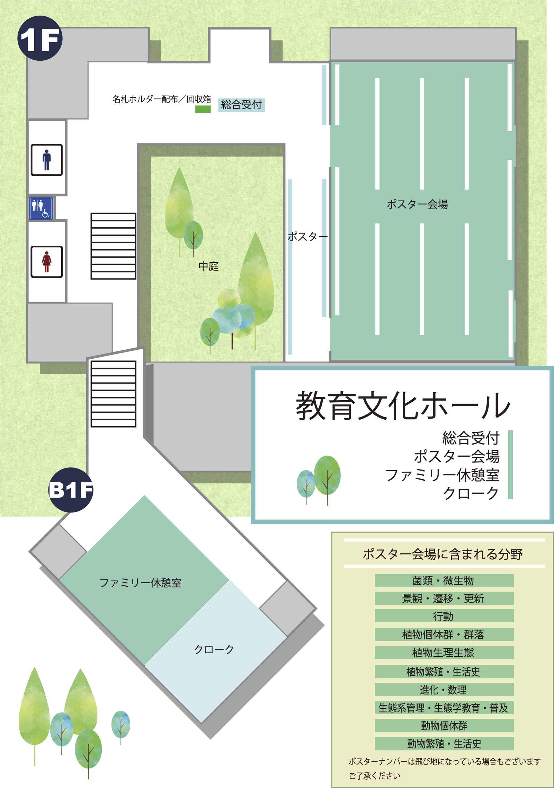
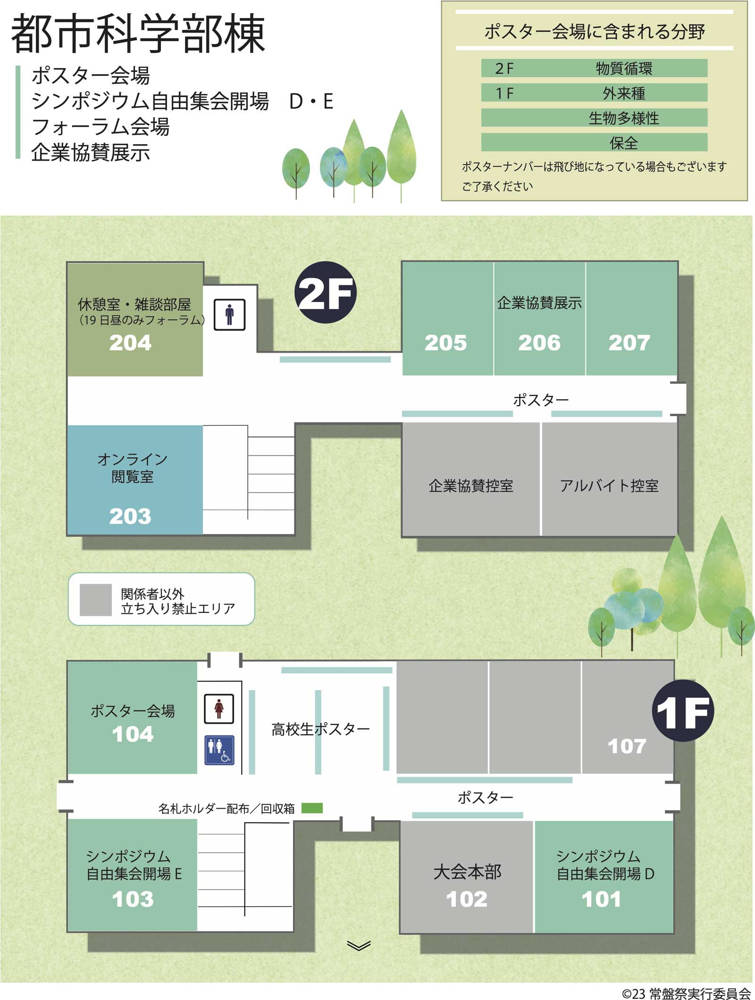
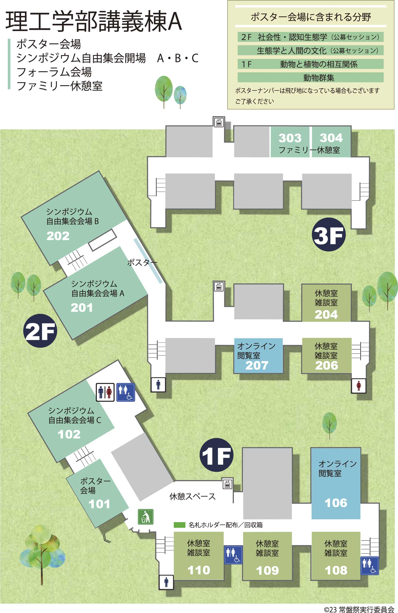
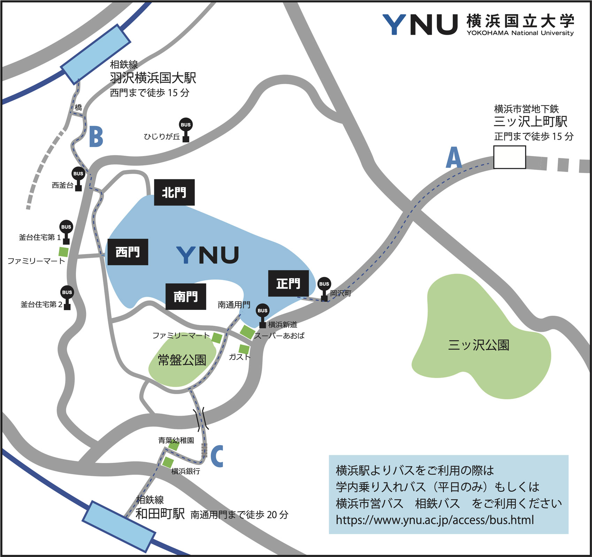

<!--実行委員会担当者様

運営部会よりお願い

ESJ72のWebサイト上で掲載する「会場」についてのWebページの執筆をお願いします。去年の原稿を基にした構成原案をお送りします。原稿を執筆の上、締め切りまでにWeb掲載依頼チャンネルにてお送りください。公開は9月下旬を予定しています。

・Webサイト更新は、9月下旬の次は応募締切後の12月を予定しています。
・お送りしているのは、ESJ71における会場情報の「完成系」であるため、9月時点ですべての項目をご用意いただく必要はありません。12月の更新タイミングに向けて、ページの項目をご準備ください。
・構成原案はあくまで参考ですので、適宜情報が伝わりやすいよう、情報の取捨選択も含めて編集をお願いします。

お手数おかけしますが、よろしくお願いいたします。

運営部会長　橋本洸哉
-->

# 大会案内/会場案内

### 会場

### 横浜国立大学（3月19日〜21日）

  
\[[教育文化ホール 案内図 PDF版](https://esj-meeting.net/wp-content/uploads/2024/03/venue_1_ja.pdf)\]

  
\[[都市科学部棟 案内図 PDF版](https://esj-meeting.net/wp-content/uploads/2024/02/venue_2_ja.pdf)\]

  
\[[理工学部講義棟A 案内図 PDF版](https://esj-meeting.net/wp-content/uploads/2024/03/venue_3_ja.pdf)\]

### 大会受付

- 名札を持参された方の受付は不要です。名札は各自で大会プラットフォームONLINE CONFよりダウンロードし、印刷して会場に持参してください。名札フォルダーを各会場（理工学部講義棟A、都市科学講義棟、教育文化ホール）にて配布します。会場では、名札を必ずつけてください。
- 名札を忘れた際には、受付（教育文化ホール）にて名札または参加証（大会プラットフォームONLINE CONFよりダウンロード可能）を画面提示してください。指定の台紙をお渡しします。台紙に名前を記入し、名札フォルダーに入れ、必ずつけてください。
- 当日参加も可能です。オンライン上で申し込み後、受付にて名札または参加証を画面提示し、指定の台紙に名前を記入、フォルダーにいれて身につけてください。
- 自由集会のみの聴講券(1,000 円)はオンラインでの参加のみ有効です。自由集会のみであっても、対面での参加には大会参加申し込みが必要です。
- 公開講演会3/19のみの参加は、申し込みの必要はありません（先着600名）。

### 場所・時間

### 横浜国立大学 教育文化ホール１階

- 3/19（火）8：30 – 18：15
- 3/20（水）8：30 – 18：15
- 3/21（木）8：30 – 12：15

### クローク

### 場所・時間

### 教育文化ホール地下102

- 3/19（火）8：30 – 18：15
- 3/20（水）8：30 – 18：15
- 3/21（木）8：30 – 12：15

### 注意事項

- お荷物をお預けの際には、係よりクローク札をお渡しいたします。
- お荷物をお引き取りの際には、クローク札を係の者へお渡し願います。クローク札を紛失されますと、お荷物のお引き渡しはできません。
- 大きいかばん類のみをお預かりします。傘やコートなど衣服類はかばん類とまとめていただきますようお願いします。貴重品、壊れもの、生鮮品等（要冷蔵・冷凍品を含む）を含むお荷物はお預かりできません。また，盗難、紛失及び破損等の責任は負いかねます。
- 地下１階まではエレベーターがないため、徒歩で降りることになります。スーツケースの運搬等はスタッフが補助しますので、遠慮なくお声がけください。
- お荷物のお預かりは当日のみとします。
- 火災や地震発生等の非常時にはクロークは閉鎖いたします。

### インターネット接続

- 原則、会場でのeduroamを使って、大学のネットワークに接続した上での、来場者の動画視聴（Zoom接続、見逃し配信動画を含む）は禁止です。これは、ハイブリッド配信の安定性を第一に確保するためですので、どうかご理解ください。動画視聴をしたい場合は、各自のポータブルWiFiや携帯などを使うか、オンライン閲覧室に設置のWiFiを利用してください。
- シンポジウム・自由集会・フォーラムの企画者（代表者1名）にはYNU-WiFiに接続するためのゲストアカウントを発行します。アカウント情報は受付（教育文化ホール）にてお渡しします。
- オンライン閲覧室では各部屋にWiFiのルーターを2機設置します。動画視聴（Zoomライブ接続、見逃し配信動画を含む）が可能です。動画視聴の際はイヤホンを使用し、静寂な環境を保っていただけますようお願いします。オンライン閲覧室での打ち合わせはご遠慮ください。

### 会場での飲食、喫煙等

- 飲食可能ですが、講演中の飲食は避けるなど、他の参加者に配慮した行動をお願いいたします。ゴミは各自でできる限り持ち帰るよう、ご協力をお願いいたします。
- 会場は全面禁煙です。喫煙は屋外の指定された場所 （[キャンパス内特定屋外喫煙場所](https://www.ynu.ac.jp/campus/attention/smoking.html)）でお願いします。

### 休憩室

- 会場各所に休憩室を設けました。昼食や打ち合わせにご活用ください（お子様と利用できる施設に関する情報は[こちら](https://esj-meeting.net/venue_ja/childcare_facilities_ja)をご参照ください）。

### 昼食

- 横浜国立大学の周辺には飲食店・販売店が限られます。昼食をご持参いただくことを推奨いたします。とくに20日（水）（祝日）は生協や図書館カフェの営業がありませんので、昼食のご持参を強く推奨いたします。
- **学内の食堂・カフェ・コンビニ（[地図](https://esj-meeting.net/wp-content/uploads/2024/03/campus_map_ja.pdf)）**
  - 生協第一食堂 休業
  - 生協第２食堂 平日（3/19、3/21）、昼営業（11:30−13:30）
  - 図書館カフェ 平日（3/19、3/21）、昼営業（12:00−15:00）
  - コンビニ（ローソン）　平日（3/19、3/21）7:00～20:00、休日（3/20）7：00：00−15：00

### 諸注意

- 大会で使用していないフロア・教室への立ち入りはご遠慮ください。
- 講演・ポスターの撮影・録画は、発表者の了承を得た場合に限り認められます。また、認められた撮影・録画についても周囲の方に迷惑がかからないようにしてください。

### アクセス

### 横浜駅からバスを利用

バス利用の詳細は[横浜国立大学のアクセス案内](https://www.ynu.ac.jp/access/index.html)を確認して下さい。  
### なお、3月20日は祝日のため、学内乗り入れバスは運休です。

### 電車と徒歩

  
\[[PDF版](https://esj-meeting.net/wp-content/uploads/2024/02/neighbourhood_map_ja.pdf)\]

- **A**: 三ツ沢上町駅から（徒歩約15分、[駅からの地図](https://www.ynu.ac.jp/access/train_front.html)）
- **B**: 羽沢横浜国大駅から（徒歩約15分、[駅からの地図](https://www.ynu.ac.jp/access/train_hazawa.html)）
- **C**: 和田町駅から（徒歩約20分、[駅からの地図](https://www.ynu.ac.jp/access/train_south.html)）

### キャンパスマップ

  
\[[PDF版](https://esj-meeting.net/wp-content/uploads/2024/03/campus_map_ja.pdf)\]

- **教育文化ホール（[学内マップ S1-2](https://www.ynu.ac.jp/access/map_campus.html)）**
  - ポスター・ファミリー休憩室・受付・クローク
- **都市科学部講義棟（[学内マップ S2-1](https://www.ynu.ac.jp/access/map_campus.html)）**
  - シンポ・自由集会・フォーラム・ポスター・企業展示
- **理工学部講義棟A（[学内マップ S5-5](https://www.ynu.ac.jp/access/map_campus.html)）**
  - シンポ・自由集会・フォーラム・ポスター・ファミリー休憩室
- **経済学部講義棟2号館（[学内マップ N4-3](https://www.ynu.ac.jp/access/map_campus.html)）**
  - 公開講演会

### バリアフリーマップ

[横浜国立大学のページ](https://www.ynu.ac.jp/access/map_barrierfree.html)をご確認下さい。

