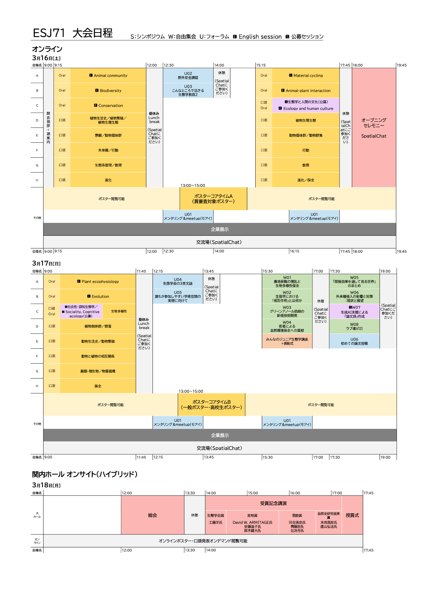
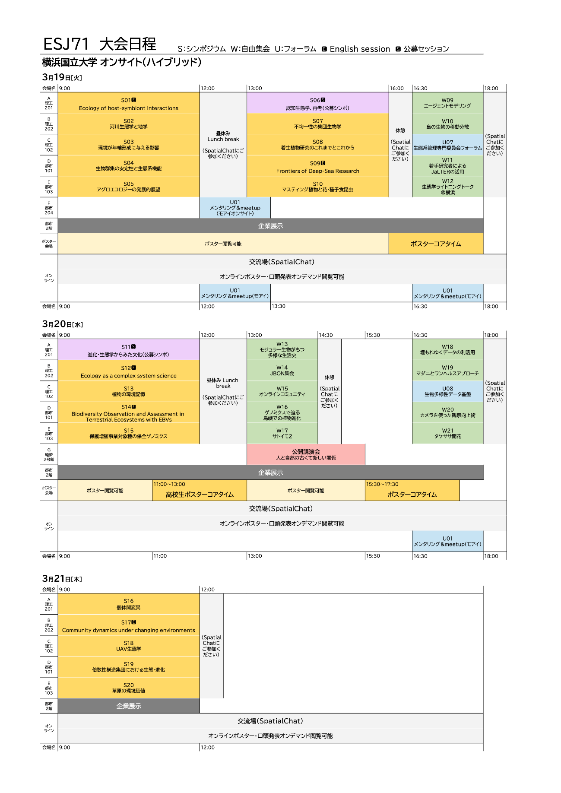

# 大会案内/概要

**大会概要**

第71回日本生態学会大会（ESJ71）  
日程：2024年3月16日(土)〜21日(木)  
会場：横浜国立大学 / オンライン

**大会日程**

**大会スケジュール**

<table>
<colgroup>
<col style="width: 19%" />
<col style="width: 14%" />
<col style="width: 14%" />
<col style="width: 12%" />
<col style="width: 12%" />
<col style="width: 12%" />
<col style="width: 13%" />
</colgroup>
<thead>
<tr class="header">
<th></th>
<th><strong>3月16日 
（土）</strong></th>
<th><strong>3月17日 
（日）</strong></th>
<th><strong>3月18日 
（月）</strong></th>
<th><strong>3月19日 
（火）</strong></th>
<th><strong>3月20日 
（水・祝日）</strong></th>
<th><strong>3月21日 
（木）</strong></th>
</tr>
</thead>
<tbody>
<tr class="odd">
<td></td>
<td>オンラインのみ</td>
<td>オンラインのみ</td>
<td>ハイブリッド</td>
<td>ハイブリッド</td>
<td>ハイブリッド</td>
<td>ハイブリッド</td>
</tr>
<tr class="even">
<td>総会</td>
<td></td>
<td></td>
<td>○</td>
<td></td>
<td></td>
<td></td>
</tr>
<tr class="odd">
<td>授賞式・受賞講演</td>
<td></td>
<td></td>
<td>○</td>
<td></td>
<td></td>
<td></td>
</tr>
<tr class="even">
<td>懇親会</td>
<td>○</td>
<td></td>
<td></td>
<td></td>
<td></td>
<td></td>
</tr>
<tr class="odd">
<td>オンライン交流会</td>
<td>○</td>
<td>○</td>
<td>○</td>
<td>○</td>
<td>○</td>
<td>○</td>
</tr>
<tr class="even">
<td>シンポジウム</td>
<td></td>
<td></td>
<td></td>
<td>○</td>
<td>○</td>
<td>○</td>
</tr>
<tr class="odd">
<td>自由集会･フォーラム</td>
<td>○</td>
<td>○</td>
<td></td>
<td>○</td>
<td>○</td>
<td>○</td>
</tr>
<tr class="even">
<td>口頭発表･英語口頭発表</td>
<td>○</td>
<td>○</td>
<td></td>
<td></td>
<td></td>
<td></td>
</tr>
<tr class="odd">
<td>ポスター発表</td>
<td>○</td>
<td>○</td>
<td></td>
<td>○※1</td>
<td>○※1</td>
<td></td>
</tr>
<tr class="even">
<td>高校生ポスター発表</td>
<td>○</td>
<td>○</td>
<td></td>
<td>○※1</td>
<td>○※1</td>
<td></td>
</tr>
<tr class="odd">
<td>ジュニア生態学講座</td>
<td></td>
<td>○</td>
<td></td>
<td></td>
<td></td>
<td></td>
</tr>
<tr class="even">
<td>公開講演会</td>
<td></td>
<td></td>
<td></td>
<td></td>
<td>○</td>
<td></td>
</tr>
</tbody>
</table>

※1 オンラインのポスター発表（高校生ポスターを含む）を行なった方は、希望する場合、ハイブリッド開催期間中に現地会場でもポスターを掲示することができます。

**開催形式**

- 大会はオンライン（3月16・17日）およびハイブリッド（会場 + オンライン、3月18〜21日）形式で開催されます。

- 大会のオンラインプラットフォーム（以下、大会プラットフォーム）として[ONLINE CONF](https://agri-smile.com/service/online-conf/)を用います。大会プラットフォーム上では、タイムスケジュールや各セッションの講演情報や講演要旨、演者のプロフィールなどが閲覧できるほか、各種集会や口頭発表へのアクセス、ポスターファイルの閲覧が行なえます。

- 3月16・17日のポスター発表を除く講演は[Zoomのミーティング](https://zoom.us/jp-jp/meetings.html)を用いて実施します。口頭発表・英語口頭発表では、事前に収録した講演動画が大会プラットフォーム上で公開され、発表時刻にZoomで配信される予定です。講演動画の再生終了後、発表者に質疑応答をライブで行っていただきます。

- 3月16・17日のポスター発表は、大会プラットフォームにアップロードされたポスターファイルを、参加者が大会期間中に自由に閲覧するという形式で実施します。コアタイムには大会プラットフォーム上のビデオ会議機能を利用して、ポスターの説明や質疑応答を行なっていただきます。

- 3月18〜21日の講演は会場（横浜国立大）での発表とzoomでのリアルタイム配信を同時に行っていただきます。オンラインでのポスター発表（高校生ポスターを含む）を行なった方は、希望する場合、3月19・20日に会場でもポスターを掲示することができます。

- 口頭発表・英語口頭発表を除くすべての講演は、発表中に録画されます。これらの講演動画は、講演の１〜２営業日後から大会終了の3週間後までの期間、大会プラットフォーム内で参加者に向けて公開され続けます。公開の可否については、申込時に確認します。

**参加者の交流の促進**

**オンライン交流会**

SpatialChat を用いてオンライン形式の交流会を開催します。口頭発表の各セッションや各集会(シンポジウムや自由集会)の終了後、30分の交流時間を設けます。参加したセッションや集会の交流スペースに参加していただき、分野の近い方との交流をお楽しみください。もちろん、参加したセッションや集会以外の交流スペースに入室することも可能です。実りある大会にするためにも、積極的な参加を歓迎します。

**大会公式懇親会**

SpatialChat を用いてオンライン形式の懇親会を開催します。大会参加者 (高校生や自由集会聴講者を除く)なら誰でも参加できます。懇親会費は無料となります。参加申込も不要です。詳細は大会プラットフォーム上でお知らせします。

**各種締切と諸経費**

参加・講演の申し込みや集会企画の方法についての詳細は[大会参加案内](https://esj-meeting.net/basic_information_ja/registration_guidelines_ja)、[一般講演の申し込み](https://esj-meeting.net/basic_information_ja/oral_and_poster_sessions_ja)、[各種集会の企画](https://esj-meeting.net/basic_information_ja/session_proposal_guidelines_ja)、[高校生ポスター・みんなのジュニア生態学講座](https://esj-meeting.net/basic_information_ja/high_school_student)をご覧ください。

**参加申込み関連**

<table style="width:100%;">
<colgroup>
<col style="width: 25%" />
<col style="width: 23%" />
<col style="width: 26%" />
<col style="width: 24%" />
</colgroup>
<thead>
<tr class="header">
<th></th>
<th><strong>一般・学生</strong></th>
<th><strong>自由集会のみの聴講／ 
高校生対象企画のみの聴講</strong></th>
<th><strong>講演のない学部生・中高生</strong></th>
</tr>
</thead>
<tbody>
<tr class="odd">
<td>参加申込みと参加費の支払い</td>
<td>2023年10月2日 
〜大会当日</td>
<td>2023年10月2日 
〜2024年1月31日</td>
<td>2024年3月1日 
〜大会当日</td>
</tr>
<tr class="even">
<td>参加費</td>
<td>早期割引価格（〜1/31） 
一般：13,000円 
学生：6,000円 
 
通常価格（3/1〜） 
一般：15,000円 
学生：7,000円</td>
<td>1,000円（自由集会のみ ※） 
0円（高校生対象講座のみ）</td>
<td>無料</td>
</tr>
</tbody>
</table>

※ 自由集会のみ参加はオンライン参加のみとし、オンサイト参加は不可です。

**大会における多様性の推進**

生態学会大会は多様性を尊重します。多様な立場やジェンダー、国籍の研究者からの意欲的な提案を期待しています。またシンポジウム・自由集会の企画者は、企画者や講演者の立場やジェンダーなどのバランスに配慮して集会を構成してください。  
「障害者差別解消法」に基づく配慮を行ないますので、大会参加に際して、配慮を必要とされる方は、大会公式ホームページにある「お問い合わせフォーム」からご相談ください。講演を希望される方は、できるだけ2023年10月31日までにご相談ください。

**大会企画委員会**

<table>
<colgroup>
<col style="width: 11%" />
<col style="width: 88%" />
</colgroup>
<thead>
<tr class="header">
<th>企画委員長</th>
<th>大澤剛士</th>
</tr>
</thead>
<tbody>
<tr class="odd">
<td>企画副委員長</td>
<td>高橋一男</td>
</tr>
<tr class="even">
<td>運営部会</td>
<td>小林卓也、橋本洸哉、高野宏平、京極大助、境優、松岡俊将、立木佑弥、田邊晶史、才木真太朗、小黒芳生</td>
</tr>
<tr class="odd">
<td>シンポジウム部会</td>
<td>德田誠、佐藤永、大舘智志、平田晶子、今田弓女、田村大也、栗原洋介、渡部俊太郎、野田響、東若菜、井坂友一、今井伸夫</td>
</tr>
<tr class="even">
<td>ポスター部会</td>
<td>平野尚浩、西嶋翔太、長谷川成明、平山貴美子、松橋彩衣子、山下聡、島田直明、樋口裕美子、柴田あかり、小出大、友常満利、田路翼、松葉史紗子、高木俊人、松村健太郎、永濱藍</td>
</tr>
<tr class="odd">
<td>高校生ポスター部会</td>
<td>勝原光希、山﨑曜、坂田ゆず、酒井聡樹、桜井良、佐賀達矢、藤岡春奈、望月昂、小峰浩隆、中林雅、松本哲也、辻冴月、宮田理恵</td>
</tr>
<tr class="even">
<td>発表編成部会</td>
<td>松崎慎一郎、冨松元、源利文、森英樹、福井翔、吉岡明良、片山直樹</td>
</tr>
<tr class="odd">
<td>英語口頭発表部会</td>
<td>上村真由子、福森香代子、水元惟暁、小林真、門脇浩明、塩尻かおり、畑啓生、Jamie M. Kass、鄭 峻介、安立美奈子 
オブザーバー：辰巳晋一、森井悠太、入谷亮介</td>
</tr>
<tr class="even">
<td>オンライン部会</td>
<td>深谷肇一、境優、松岡俊将、小峰浩隆、松本哲也、小出大、島田直明、小林真、安立美奈子、德田誠、佐藤永、松崎慎一郎、冨松元 
オブザーバー：細将貴</td>
</tr>
</tbody>
</table>

**大会実行委員会**

| 大会会長 | 小池文人 |
|----|----|
| 実行委員長 | 鏡味麻衣子 |
| 実行副委員長 | 佐々木雄大 |
| 実行委員会メンバー | 東若菜、荒木希和子、岩崎 雄一、大舘智志、小黒芳生、北川涼、木村恵、倉田薫子、小出大、佐藤永、高野（竹中）宏平、瀧本岳、徳田誠、冨松元 、中臺亮介、西嶋 翔太、野田響、平田晶子、深谷肇一、福井翔、古川拓哉、松倉君予、松崎慎一郎、松田裕之、諸澤崇裕、山﨑曜、吉岡明良 |

