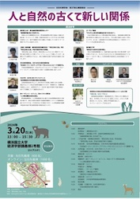
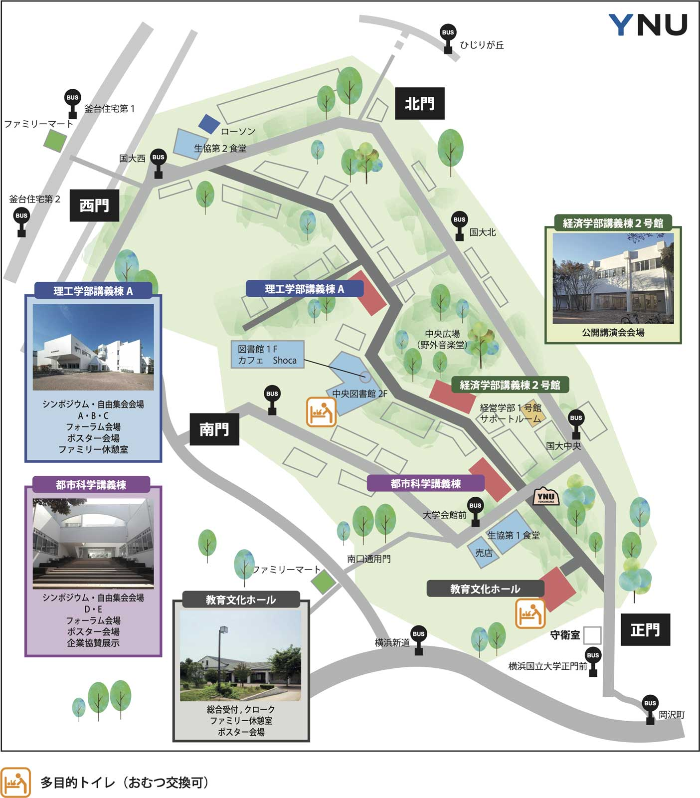

# 日程・各種企画/日本生態学会 第27回公開講演会

**人と自然の古くて新しい関係**

原生自然だけでなく、人を含めた自然を守ることが共通認識となりつつあります。都市の自然も重視されるようになりました。一方、人口縮小時代において、鳥獣被害は深刻化し、人と野生動物の「新たな関係」を迫られています。国際社会で何が起きているのか、生物多様性条約、野生動物管理、持続可能な開発のための教育(ESD)の最前線で活動する専門家の声を聴き、参加者の皆さんと一緒に「人と自然の関係」を見つめ直す機会となればと思います。

**日時**：2024年3月20日(水) 13：00 – 15：30  
**場所**：横浜国立大学経済学部講義棟2号館（ハイブリッド）  
**参加費**：無料  
**対面会場**：当日先着順 600名  
**オンライン会場**：当日先着順 1000名  
**Zoomウェビナー形式によるオンライン配信**:

- **接続先**: <https://zoom.us/j/98878186754?pwd=NVVFd25pV0xWazhvcTIrT1dEeFZHQT09>

- **ミーティングID**: 988 7818 6754

- **パスワード**: 110312

**ポスター**

  
[ポスター(PDF)をダウンロード](https://esj-meeting.net/wp-content/uploads/2024/01/public_lecture.pdf)

**会場（経済学部講義棟2号館）**

  
会場へのアクセスは[会場案内](https://esj-meeting.net/public_lecture/venue_ja)や横浜国立大学の[キャンパスマップ (N4-3)](https://www.ynu.ac.jp/access/map_campus.html)も参考にして下さい。

**プログラム**

<table>
<colgroup>
<col style="width: 6%" />
<col style="width: 93%" />
</colgroup>
<thead>
<tr class="header">
<th><strong>時間</strong></th>
<th><strong>発表者／発表内容</strong></th>
</tr>
</thead>
<tbody>
<tr class="odd">
<td>13:00</td>
<td>松田裕之（横浜国立大学） 
趣旨説明</td>
</tr>
<tr class="even">
<td>13:05</td>
<td>宇野裕之（東京農工大学 野生動物管理教育研究センター） 
「鳥獣害管理の担い手を育てる」</td>
</tr>
<tr class="odd">
<td>13:10</td>
<td>八代田千鶴（（国研）森林機構 森林総合研究所関西支所／「野生生物と社会」学会） 
「「野生生物と社会」学会の目指す新たな関係」</td>
</tr>
<tr class="even">
<td>13:15</td>
<td>朱宮丈晴（日本自然保護協会、日本MAB計画支援委員会） 
「日本版ネーチャーポジティブアプローチをユネスコエコパークで展開する」</td>
</tr>
<tr class="odd">
<td>13:20</td>
<td>古田尚也（大正大学、IUCN日本リエゾンオフィス） 
「自然保護区以外の普通の場所の自然保護(仮)」</td>
</tr>
<tr class="even">
<td>13:40</td>
<td>質疑応答・コメント 
橋本禅（東京大学）</td>
</tr>
<tr class="odd">
<td>13:50</td>
<td>須藤明子（㈱イーグレット・オフィス、日本イヌワシ研究会） 
「人と野生動物の共存に挑む」</td>
</tr>
<tr class="even">
<td>14:10</td>
<td>質疑応答・コメント 
中尾文子（環境省） 
村田浩一（ズーラシア園長） 
「そもそも人間と野生動物は共存できるのか？」</td>
</tr>
<tr class="odd">
<td>14:20</td>
<td>倉田薫子（横浜国立大学） 
「高校生から始める生物多様性」</td>
</tr>
<tr class="even">
<td>14:40</td>
<td>質疑応答・コメント 
安田昌則（大牟田市教育委員会、日本ユネスコ協会連盟）</td>
</tr>
<tr class="odd">
<td>14:50</td>
<td>総合討論</td>
</tr>
<tr class="even">
<td>15:25</td>
<td>北島薫（京都大学、日本生態学次期会長） 
「日本生態学会の取り組み」</td>
</tr>
<tr class="odd">
<td>15:30</td>
<td>閉会</td>
</tr>
</tbody>
</table>

**企画** 日本生態学会横浜大会実行委員会  
**司会** 松田裕之（横浜国立大学）

**主催**：日本生態学会  
**共催**：「野生生物と社会」学会  
**後援**：日本MAB計画支援委員会、横浜国立大学総合学術高等研究院生物圏研究ユニット

**お問い合わせ**

**問い合わせを送る**

[こちらのフォーム](https://otoiawase.jp/do/public/form/seitai/2)からお問い合わせ下さい。お問い合わせの前に、[よくある質問](https://esj-meeting.net/contact_ja/faq_ja)をご確認願います。

**各締切日の17:00〜翌日10:00はお問い合わせに対応できません。**  
各種手順の確認はお早めにお願いします。

