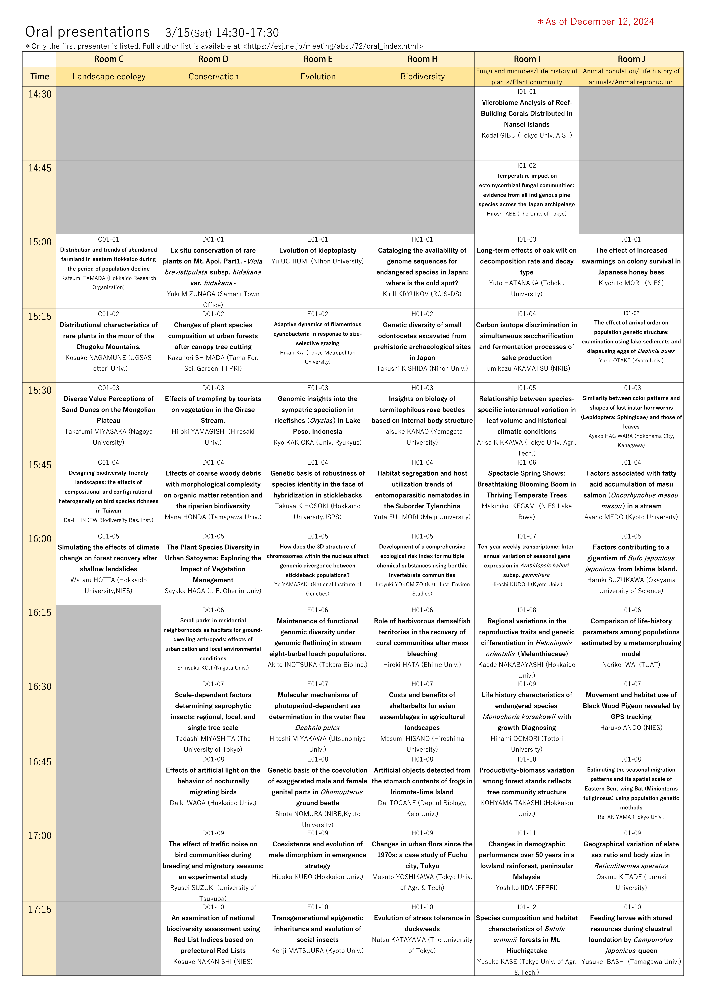
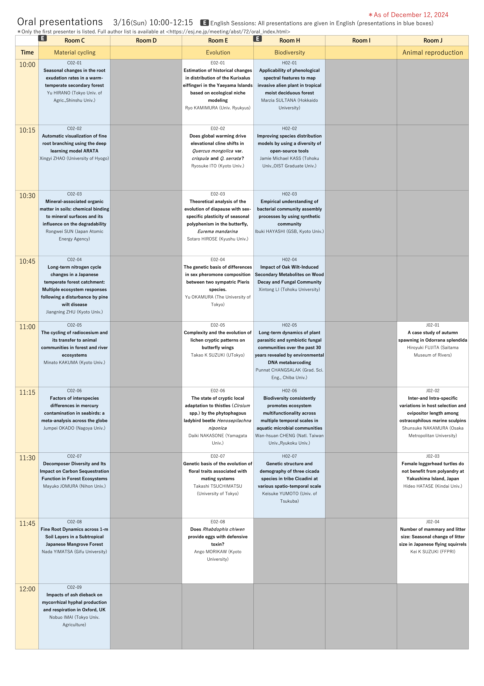
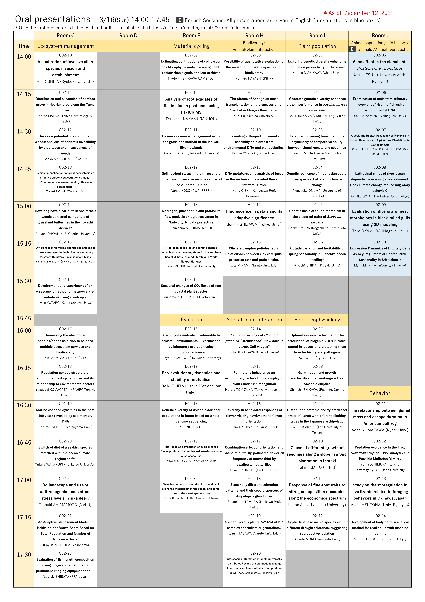
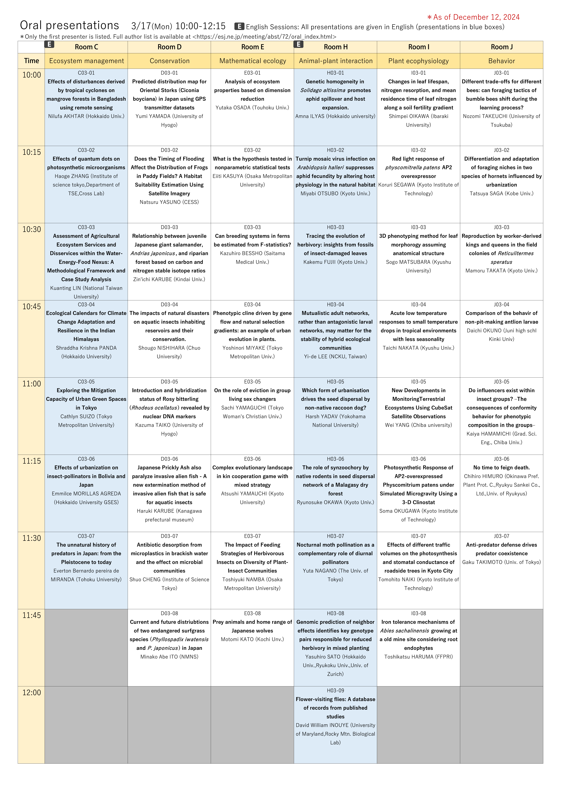
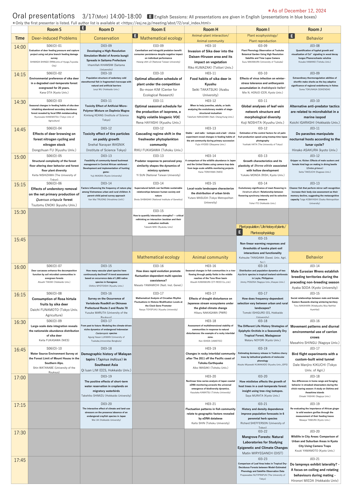
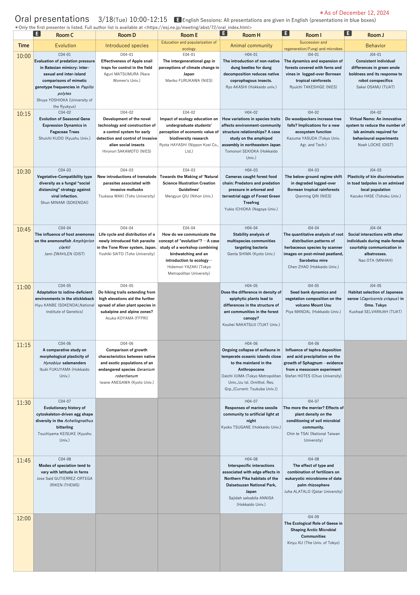
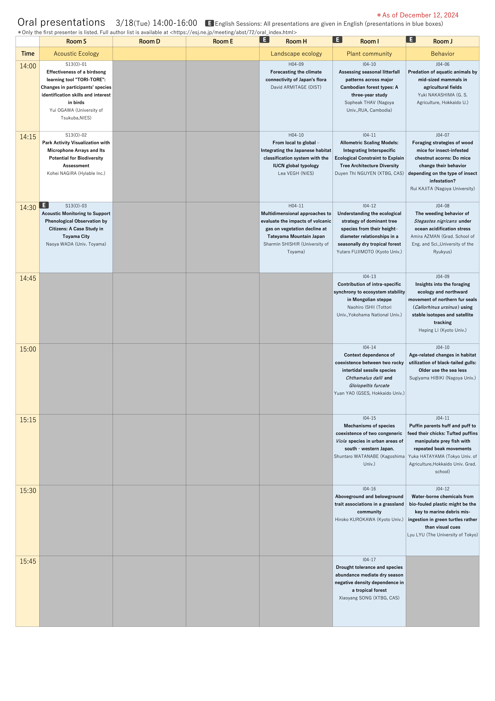

# Schedule and Programs

## Schedule

- On-demand streaming will be available for sessions to be held at Rooms S, A, B, F, and G with some exceptions. Please refer to the PDF of the conference schedule below.
- Details of each presentation date and time are now available on the [Conference Abstract Viewing Page](https://esj.ne.jp/meeting/abst/index.html). 

[Schedule (2/27 ver.) PDF file](https://esj-meeting.net/wp-content/uploads/2025/02/スケジュール概要_en_ESJ72_20250227.pdf)

## Programs

- The program is now available from the Ecological Society of Japan's [Conference Abstract Viewing Page] (https://esj.ne.jp/meeting/abst/index.html). The abstract of each presentation is now under preparation.

[Oral presentation programs（12/13 ver.）PDF](../media/EN_ESJ72_Oral_20241212.pdf)

