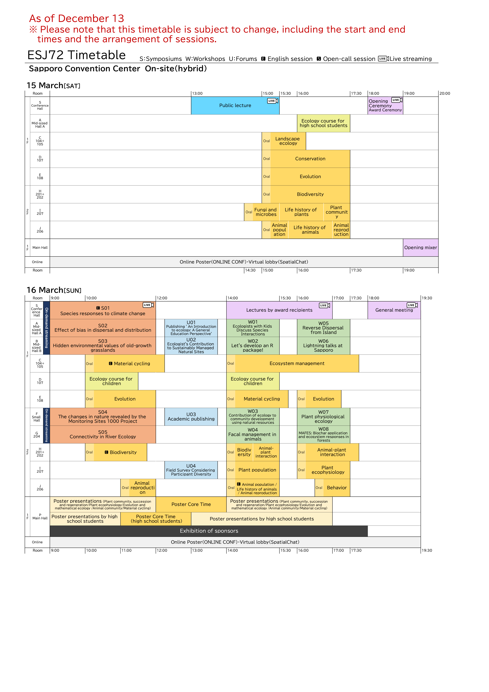
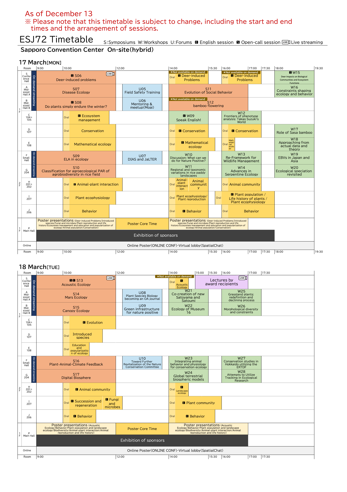

# Schedule and Programs

## Schedule
<!---以下の一点目は、html作成時に赤字にしてください--->
- The start and end times and layout of sessions are subject to change. Please use this information as a reference when making reservations for airline tickets and accommodations.
- Details of each presentation date and time are now available on the [Conference Abstract Viewing Page](https://esj.ne.jp/meeting/abst/index.html). Abstract information is not yet included, but please use this page to confirm the date and time of your presentation.

[Schedule (12/13 ver.) PDF file](../media/ESJ72_timetable_1213_en.pdf)

## Programs

- The program is now available from the Ecological Society of Japan's [Conference Abstract Viewing Page] (https://esj.ne.jp/meeting/abst/index.html). The abstract of each presentation is now under preparation.