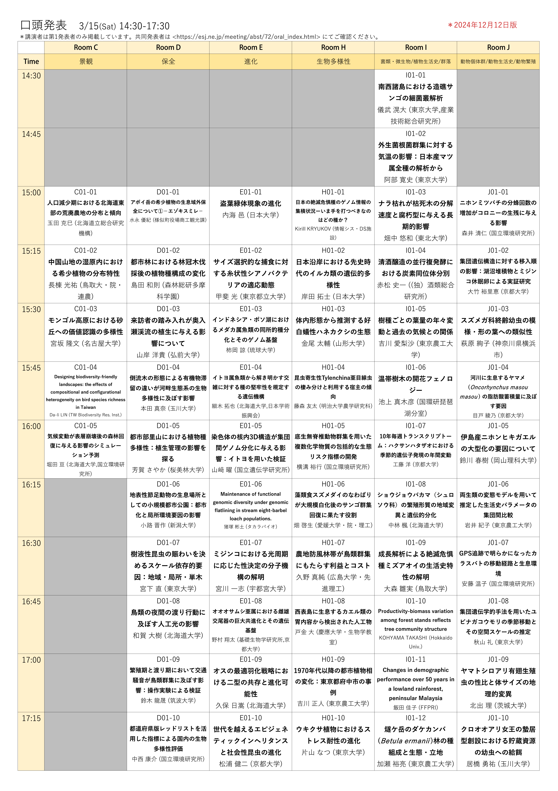
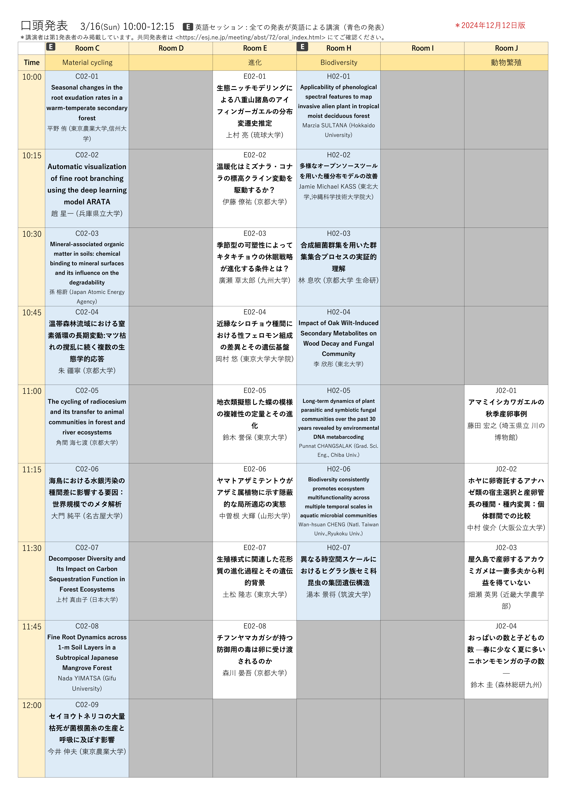
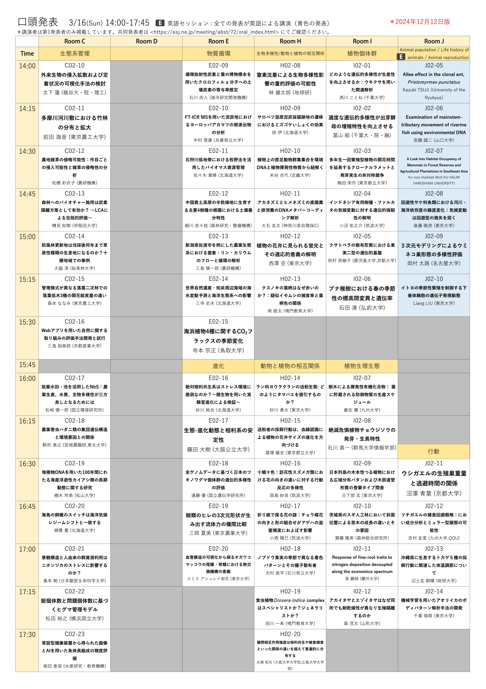
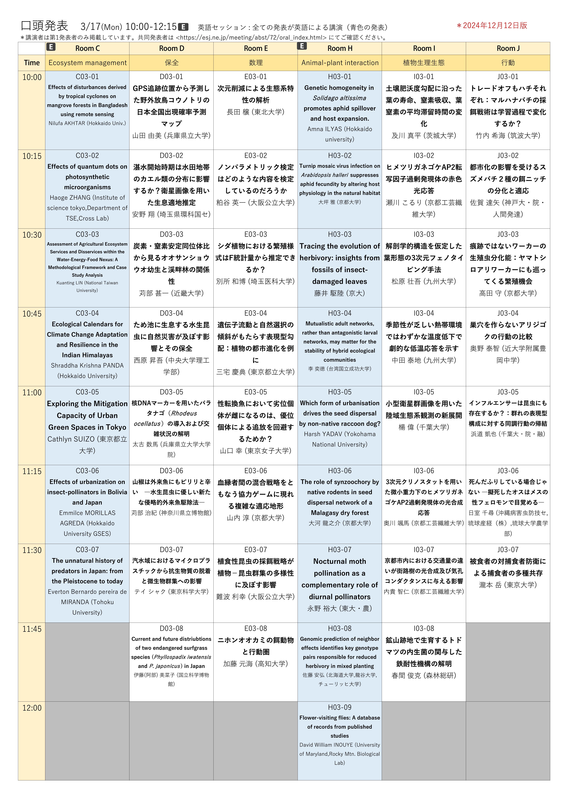
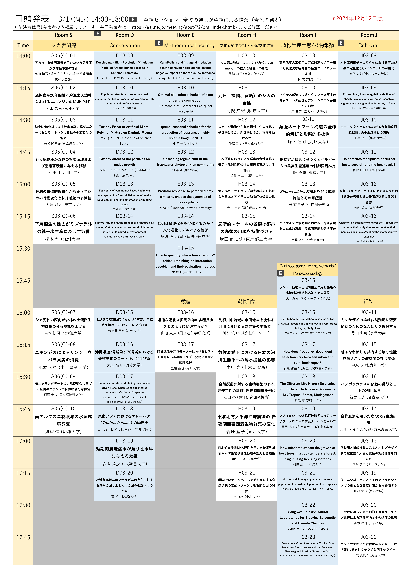
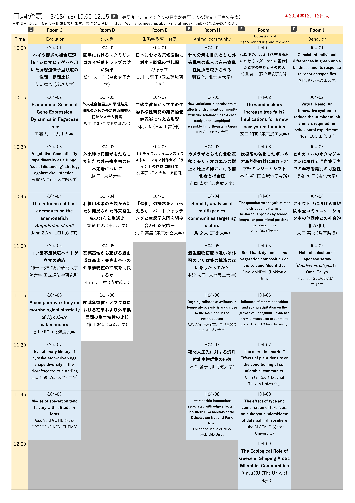
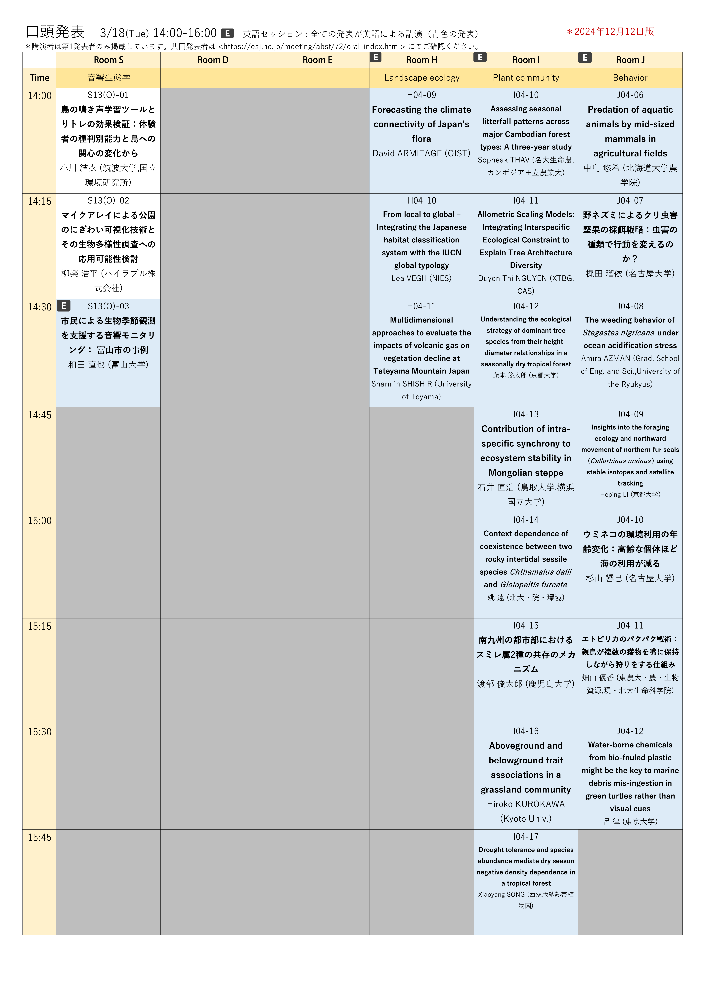

# 大会日程とプログラム

## 大会日程

- 会場S・A・B・F・Gで開催される各種集会は、一部を除いてオンデマンド配信されます。下記大会日程PDFをご参照ください。
- 各発表日時の詳細は、[大会講演要旨閲覧ページ](https://esj.ne.jp/meeting/abst/index.html)で公開しています。

[大会日程（2/27版）PDF](https://esj-meeting.net/wp-content/uploads/2025/02/スケジュール概要_ESJ72_20250227.pdf)

## プログラム

- プログラムの詳細は生態学会の[大会講演要旨閲覧ページ](https://esj.ne.jp/meeting/abst/index.html)から閲覧可能です。各発表の要旨は現在準備中です。

[口頭発表プログラム（12/13版）PDF](../media/JP_ESJ72_Oral_20241212.pdf)

