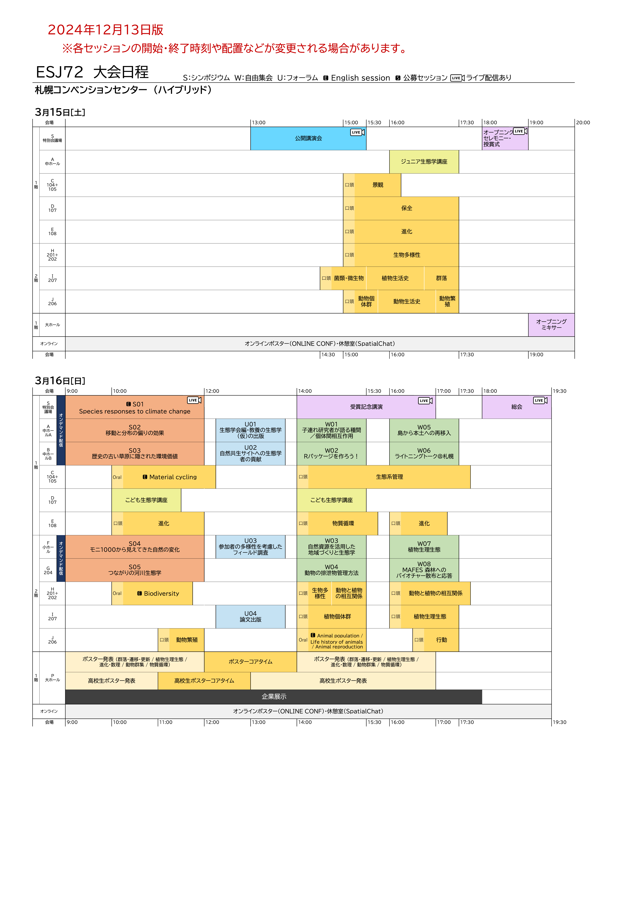
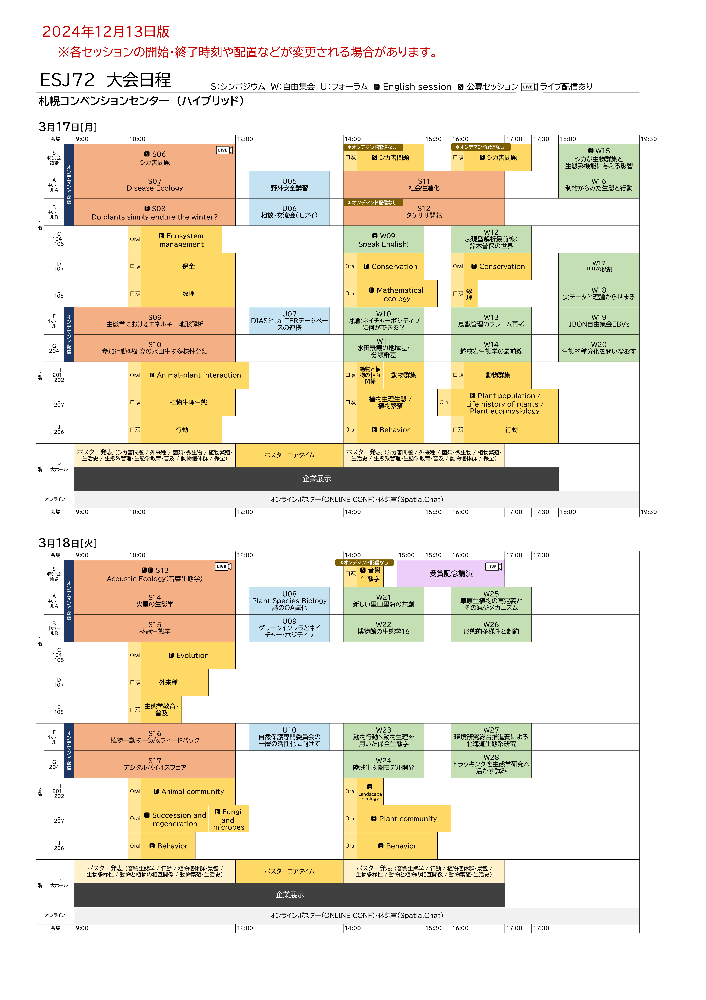

# 大会日程とプログラム

## 大会日程

<!---以下の一点目は、html作成時に赤字にしてください--->
- 各セッションの開始・終了時刻や配置などが変更される場合があります。航空券や宿泊場所の予約等のための参考情報としてお使いください。
- 各発表日時の詳細は、[大会講演要旨閲覧ページ](https://esj.ne.jp/meeting/abst/index.html)で公開しました。要旨情報はまだ含まれていませんが、発表日時の確認のためにご利用ください。

[大会日程（12/13版）PDF](../media/ESJ72_timetable_1213_ja.pdf)

## プログラム

- プログラムは生態学会の[大会講演要旨閲覧ページ](https://esj.ne.jp/meeting/abst/index.html)から閲覧可能です。各発表の要旨は現在準備中です。