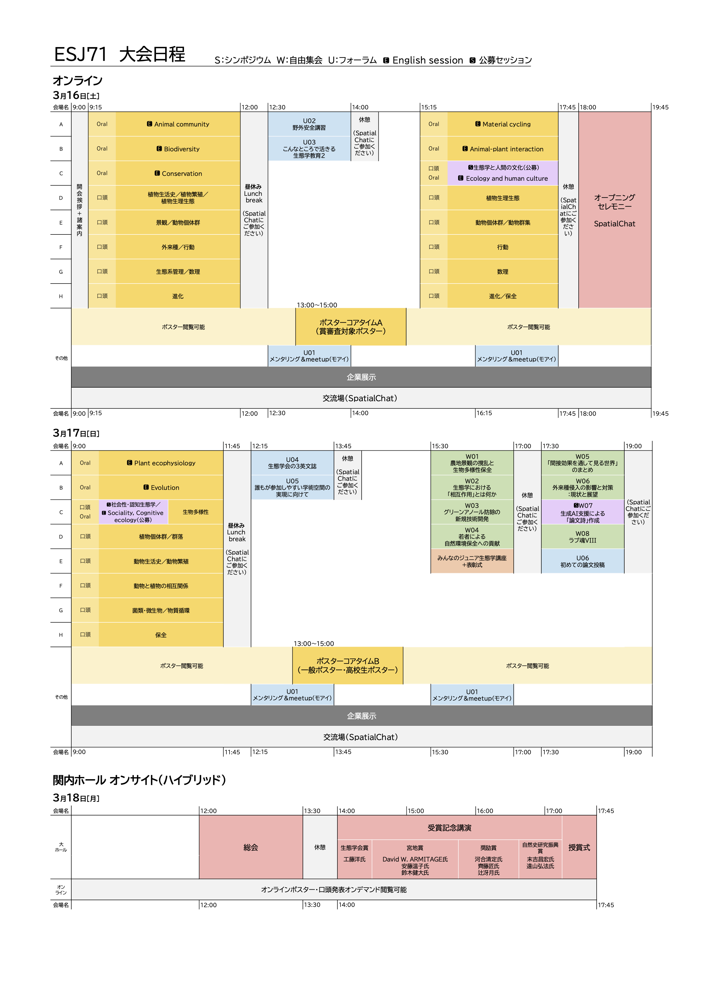
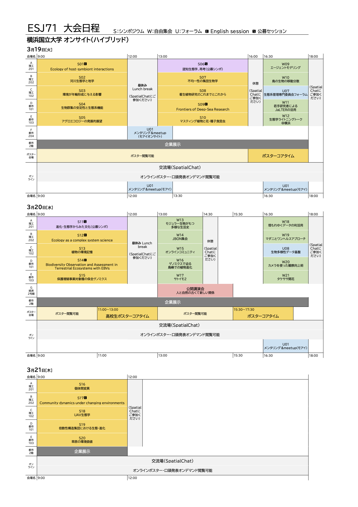

# 大会日程とプログラム

## 大会日程

<!---以下の二点は、html作成時に赤字にした方が良い--->
- 現在公開している大会日程は暫定版のため、各セッションの開始・終了時刻や配置などが変更される場合があります。航空券や宿泊場所の予約等のための参考情報としてお使いください。
- 各発表日時の詳細は、[大会講演要旨閲覧ページ](https://esj.ne.jp/meeting/abst/index.html)で公開しました。要旨情報はまだ含まれていませんが、発表日時の確認のためにご利用ください。
<!--- 日程発表が間に合わなかった場合、次の文言とする発表編成の都合上、発表登録時の第二希望以下の分野に割り当てられる可能性もありますのでご了承ください。各発表日時の詳細は、〇月〇旬頃（国際文献社に確認した日程を記載）に[大会講演要旨閲覧ページ](https://esj.ne.jp/meeting/abst/index.html)で公開予定です。--->

<!---現状、ESJ71の日程画像を試験的に入れている。レビュー時に差し替え--->

## プログラム

- プログラムは生態学会の[大会講演要旨閲覧ページ](https://esj.ne.jp/meeting/abst/index.html)から閲覧可能です。各発表の要旨は現在準備中です。