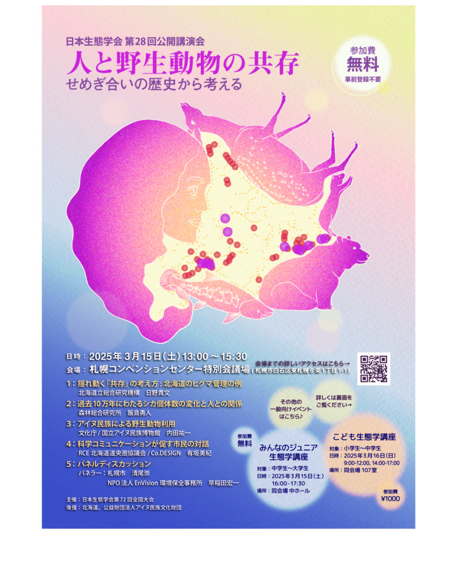
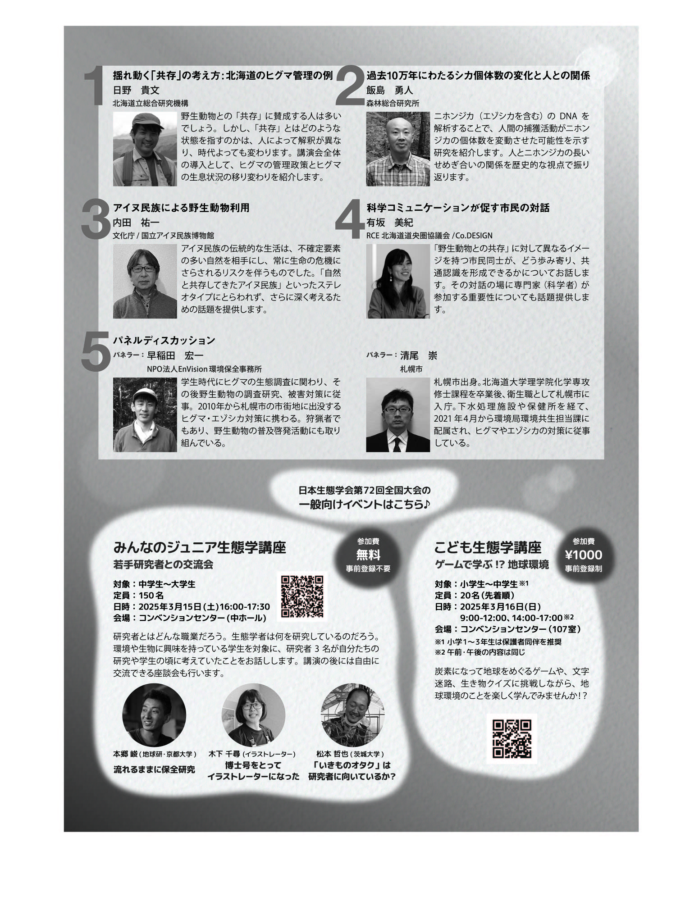

<!--実行委員会担当者様

執筆についてご案内です。

・markdown形式の細かい書き方は、説明ページ（https://github.com/hmito/esj72web/blob/main/docs/esj_web_markdown.md）をご覧ください。
・情報の準備が間に合わなければ、年明け以降の更新に先延ばしいただいてもかまいませんが、Web担当者の負担軽減のため、できれば一斉更新に間に合わせていただけると助かります。
・構成原案はあくまで参考ですので、適宜情報が伝わりやすいよう、情報の取捨選択も含めて編集をお願いします。
・英語版の作成もお願いいたします。
・提出はSlackのWeb更新依頼チャンネルからお願いします。なお、チャンネルに参加されていない場合は、運営部会宛にメールでご提出ください。

お手数おかけしますが、何卒よろしくお願いいたします。
-->

# 公開講演会

## 人と野生動物の共存: せめぎ合いの歴史から考える

野生動物との「共存」に賛成する人は多いでしょう。しかし、「共存」とはどのような状態を指すのかは人によって解釈が異なり、時代によっても変わります。そして、そのような「共存」の定義によって管理方針は大きく異なります。この講演会では、人と野生動物とのせめぎあいの歴史や科学コミュニケーションのあり方について話題提供します。どうすれば「共存」できるのか？を探る前に、そもそも「共存」とはどのような状態なのか?を一緒に考えるきっかけになればと思います。

**日時**：2025年3月15日(土) 13：00 – 15：30  
**場所**：札幌コンベンションセンター　特別会議場  
**参加費**：無料、事前登録不要  

## ポスター
  
  

[ポスター(PDF)をダウンロード](https://esj-meeting.net/wp-content/uploads/ESJ72_A4flyer_omote_ura_final.pdf)

**会場**

会場へのアクセスは[こちら](https://esj-meeting.net/venue_ja/)を参考にして下さい。

## プログラム

<table>
<colgroup>
<col style="width: 6%" />
<col style="width: 93%" />
</colgroup>
<thead>
<tr class="header">
<th><strong></strong></th>
<th><strong>発表者／発表タイトル</strong></th>
</tr>
</thead>
<tbody>
<tr class="odd">
<td>1</td>
<td>日野貴文（北海道立総合研究機構） 
揺れ動く「共存」の考え方: 北海道のヒグマ管理の例</td>
</tr>
<tr class="even">
<td>2</td>
<td>飯島勇人（森林総合研究所） 
過去10万年にわたるシカ個体数の変化と人との関係</td>
</tr>
<tr class="odd">
<td>3</td>
<td>内田祐一（文化庁/国立アイヌ民族博物館） 
アイヌ民族による野生動物利用</td>
</tr>
<tr class="even">
<td>4</td>
<td>有坂美紀（RCE北海道道央圏協議会/Co.DESIGN） 
科学コミュニケーションが促す市民の対話</td>
<tr class="odd">
<td>5</td>
<td>パネルディスカッション 
清尾崇（札幌市） 
早稲田宏一（NPO法人EnVision環境保全事務所） 
</td>
</tr>
</tbody>
</table>

**企画** 日本生態学会札幌大会実行委員会  

**主催**：日本生態学会  
**後援**：北海道、公益財団法人アイヌ民族文化財団