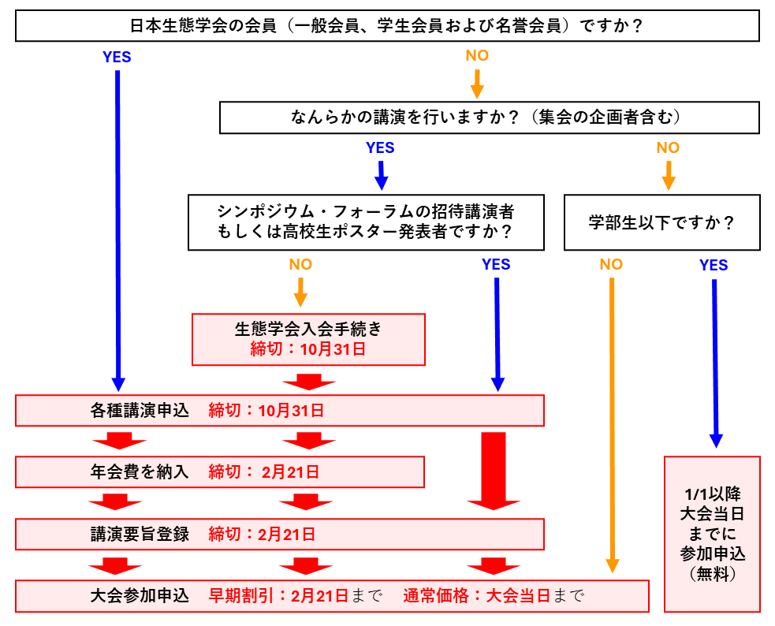

# 各種申込み概要

現在、[一般講演](regist_oral_poster)、[シンポジウム](regist_session/#シンポジウム)、[自由集会](regist_session/#自由集会)を募集中です。詳細を確認の上、下記申し込みサイトからお手続きください。

> **[【申し込みサイトへ移動】](https://iap-jp.org/esj/conf/login.php)**

重要な締切日は二つです。

|締切|参加にあたってすること|講演にあたってすること|
|---|---|---|
|**2024年10月31日（木）23:59**|---|（非会員の場合）生態学会入会申込 各種講演申込|
|**2025年2月21日（金）23:59**|早期割引価格参加申込|2024年度学会費入金 講演要旨登録|
|**大会当日**|通常価格参加申込||

以下のチャートでご自身が行うべき手続きをご確認ください。

## 講演申込み

<table>
  <colgroup>
    <col style="width: 20%" />
    <col style="width: 40%" />
    <col style="width: 40%" />
  </colgroup>
  <thead><tr class="header">
    <th>講演種別</th>
    <th><strong>申込締切</strong></th>
    <th><strong>要旨締切</strong></th>
    </tr></thead>
  <tbody>
    <tr class="odd">
      <td><a href = "opensession_ja">公募セッション</a></td>
      <td><s>2024年7月31日 (水) 23:59</s></td>
      <td rowspan=7>2025年2月21日 (金) 23:59</td>
    </tr>
    <tr class="even">
      <td><a href = "er_symposium_ja">ERシンポジウム</a></td>
      <td><s>2024年8月30日 (金) 23:59</s></td>
    </tr>
    <tr class="odd">
      <td><a href = "regist_session_jp/#フォーラム">フォーラム</a></td>
      <td>2024年9月13日 (金) 23:59</td>
    </tr>
    <tr class="even">
      <td><a href = "regist_session_jp/#シンポジウム">シンポジウム</a> 
      <td rowspan=4>2024年10月31日 (木) 23:59</td>
    </tr>
    <tr class="odd">
      <td><a href = "regist_session_jp/#自由集会">自由集会</a></td>
    </tr>
    <tr class="even">
     <td><a href = "regist_oral_poster_jp">一般講演</a> 
    </tr>
    <tr class="odd">
      <td><a href = "high_school_student">高校生ポスター</a></td>
    </tr>
  </tbody>
</table>

- 各締切日の17:00〜翌日10:00はお問い合わせに対応できません。各種手順の確認はお早めにお願いします。
- すべての締切に関して、締切後の追加や修正等の依頼には対応できません。

### 会員種別ごとの講演資格
大会での講演は原則として会員（正会員および名誉会員）に限ります。非会員の方が講演可能なのは以下の3つのケースです。

- シンポジウムで招待講演者として講演する場合
- シンポジウム・自由集会において、要旨登録を伴わないコメンテータ・意見表明者として参加する場合
- 高校生が高校生ポスターにおいて講演する場合

| **講演種別**                                      | **会員 ※1** | **非会員** |
|---------------------------------------------------|:-------------:|:------------:|
| 一般講演（口頭発表・ポスター発表） ※2             | ◯           |            |
| シンポジウム・自由集会の企画                 | ◯           |            |
| シンポジウムでの講演 ※2                           | ◯           | ◯ ※3      |
| 自由集会での講演 ※2                               | ◯           |            |
| シンポジウム・自由集会のコメンテータ・意見表明| ◯           | ◯          |

※1　日本生態学会の正会員（一般・学生）および名誉会員を指します。賛助会員は含まれません。  
※2　講演の主たる発表者（説明者）を意味します。共同発表者は会員である必要はありません。  
※3　招待講演者に限ります。

### 重複制限
大会での講演には、重複制限が設けられています。

- シンポジウム企画者・講演者は、他のシンポジウム、自由集会、一般講演の企画者・講演者となることはできません。
  - ただし、要旨登録を伴わない趣旨説明やコメンテータ・意見表明は、講演の重複制限の対象とはなりません。
- 自由集会企画者・講演者は、一般講演の講演者となることはできます。
- フォーラムの企画者・話題提供者は重複講演制限の対象となりません。

||シンポジウム|自由集会|一般講演|フォーラム|
|:---:|:---:|:---:|:---:|:---:|
|シンポジウム|×|×|×|〇|
|自由集会|×|×|〇|〇|
|一般講演|×|〇|×|〇|
|フォーラム|〇|〇|〇|〇|

※ すでに各行の種別の企画者・講演者となっている場合、× で表示されている種別の講演で新たに企画者・講演者になることはできません。

## 大会参加申込み

生態学会への新規入会は[こちらのページ](https://www.esj.ne.jp/esj/Nyukai.html#Join)からお願いします。

会費の納入状況の確認は[マイページ](https://iap-jp.org/esj/mypage/login/login)からご確認ください。

### 大会参加費

||早期申込み 2/21まで|通常申込み 2/22以降|
|---|---|---|
|**一般・学生**|？？？円|？？？円|
|**講演のない学部生・中高生**|無料|無料|

※1 2月1日〜29日はシステム移行手続きのため、参加申し込み・参加費の支払いは行なえません。  
※2 自由集会のみ参加はオンライン参加のみとし、オンサイト参加は不可です。

### 一般の参加者の場合（大学院生以上、講演のある学部生を含む）

- 大会参加申し込みと支払い手続きは、時期により利用するシステムが異なります。2024年1月31日までは大会申し込みサイト、2024年3月1日以降は大会プラットフォーム（ONLINE CONF）上で行なっていただきます（**2月1日〜29日はシステム移行手続きのため、参加申し込み・参加費支払いは行なえません**）。各サイトのURLは、大会ウェブページで案内いたします。

- 参加申し込みと支払いを別の時期に別のシステムで行なっても問題ありません。

- 大会参加費を支払うことで、大会プラットフォームの全機能を利用することができるようになります。必ず大会当日までに大会参加申し込みと参加費の支払手続きを完了してください（参加申し込みが終了した時点では、大会プラットフォームの機能の内、参加費支払いを含む一部の機能しか利用できません）。

- 大会プラットフォームにログインできなければ、ポスターのアップロードや各講演へのZoomのURLの確認ができません。講演や視聴のトラブルを軽減するため、大会前に参加費を払い、大会プラットフォームへのログインを試していただくことを強く推奨します。

- すべての申し込みについて、締切後の申し込みは一切受け付けられません。入力ミス・文字化けについても訂正しません。また、今大会は正誤表による修正も行ないませんので、十分ご注意のうえ、お申し込みください。

### 聴講者として大会公式行事に参加する場合

- 非会員の方でも、大会参加費をお支払いいただけば、聴講者として参加できます。

- 会員・非会員ともに、大会申し込みサイト、または、大会プラットフォーム上から大会参加申し込みと大会参加費の支払いを行なってください（時期により、支払いに利用するシステムが変わるのでご注意ください。参加申し込みと支払いが別のシステムでも問題ありません）。

- 自由集会のみを聴講する場合には、自由集会聴講券（1,000円）を利用可能です。自由集会のみ参加はオンライン参加のみとし、オンサイト参加は不可です。大会申し込みサイト、または、大会プラットフォームから申し込みを行ない、自由集会聴講券を購入してください。自由集会聴講券は、大会期間中複数日にわたって利用できます。

- 聴衆者としての大学の学部学生以下（中・高校生を含む）の大会参加費は「無料」です。2024年3月1日以降に大会プラットフォーム上から大会参加申し込みをなってください。

- 高校生ポスター発表会での発表、および「みんなのジュニア生態学」も参加費は無料です。詳しくは、高校生ポスター発表会・「みんなのジュニア生態学」の案内をご覧下さい。ポスター発表を行なう場合は、2023年10月31日までに参加申し込みをしてください。

### 講演または企画のための新規入会・再入会と会費の納入期限

- オンライン入会ページより入会申込みの後、会員業務窓口より仮会員番号を通知します。仮会員番号を用いて以下の集会および講演の申込みを行なってください。
- 入会申込は随時受け付けますが、講演・企画申込のためには2024年10月31日23:59までに新規入会申込・仮会員番号取得を終えて講演・企画申込をする必要があります（講演・企画申込が23:59 を超えてはいけません）。入会申込の申請から仮会員番号の発行までは時間を要する場合がありますので、講演・企画申込をする方は時間に余裕を持って入会申込をしてください。入会手続きについては入会手続きをご参照ください。
- 2024年度の年会費が未納の方は、2024年度分の会費のご納入を窓口で確認できるまでは、2025年大会での発表申込み等も出来ない状況となります。また、入金を窓口で確認しステータスの更新を行うまでは発表申し込みができませんので、発表締切の一週間前には会費の納入を済ませていただけますようお願いいたします。

## 申込みに際しての注意点
### 参加証・領収書の発行

参加証・領収書は大会申込サイトではなく大会プラットフォームONLINE CONFから発行されます。印刷物での送付はありませんのでご注意ください。ONLINE CONFが公開される3月1日以降にダウンロード可能となります。

### 正誤表の廃止

講演申込みや企画提案後の正誤表による修正を受け付けません。申込や講演要旨提出時に、内容に誤りがないか十分にご確認ください。特に学会参加経験の少ない学生は、タイトルや発表者情報などについて、指導教員などと十分に相談の上、お申込みください。

### キャンセルポリシー

各大会について公表されている返金期限（今大会は2024年1月31日）以前に参加取消の申し出があった場合は、振込手数料等の経費を除き返金いたします。  
各大会について公表されている返金期限経過後は、原則として返金いたしません。

### ESJ72において講演できなかった際の研究成果の取扱

講演要旨を登録の上、期日までに大会参加費を支払った講演者は、以下の事由により講演できなかった場合でも、本学会大会講演要旨を公開しているウェブページ上の講演情報および要旨を本学会が業績として認めます。

- 火災、地震、気象災害、人災、感染症などによる大会の中止

- 大会プラットフォームの障害や大規模なネットワークの障害  
  ただし、大会参加費を期日までに支払わなかった場合、本学会大会講演要旨を公開しているウェブページから講演情報および要旨を削除し、プログラムに記載があったとしても、当該研究は業績として認定しません。
